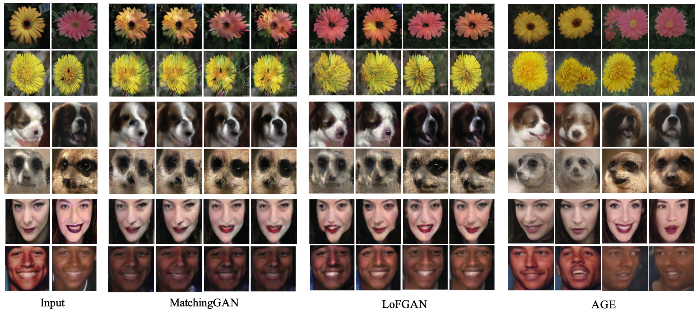

# Attribute Group Editing for Reliable Few-shot Image Generation (CVPR 2022)
<a href="https://arxiv.org/abs/2203.08422"></a>
<a href="https://opensource.org/licenses/MIT"></a>  

In this work, we propose a new “editing-based” method, i.e., Attribute Group Editing (AGE), for few-shot image generation. The basic assumption is that any image is a collection of attributes and the editing direction for a specific attribute is shared across all categories. AGE examines the internal representation learned in GANs and identifies semantically meaningful directions. Specifically, the class embedding, i.e., the mean vector of the latent codes from a specific category, is used to represent the category-relevant attributes, and the category-irrelevant attributes are learned globally by Sparse Dictionary Learning on the difference between the sample embedding and the class embedding. Given a GAN well trained on seen categories, diverse images of unseen categories can be synthesized through editing category-irrelevant attributes while keeping category-relevant attributes unchanged. Without re-training the GAN, AGE is capable of not only producing more realistic and diverse images for downstream visual applications with limited data but achieving controllable image editing with interpretable category-irrelevant directions.

<p align="center">

<br>
Comparison between images generated by MatchingGAN, LoFGAN, and AGE on Flowers, Animal Faces, and VGGFaces.
</p>

## Description   
Official implementation of AGE for few-shot image generation. Our code is modified from [pSp](https://github.com/eladrich/pixel2style2pixel.git).

## Getting Started
### Prerequisites
- Linux
- NVIDIA GPU + CUDA CuDNN (CPU may be possible with some modifications, but is not inherently supported)
- Python 3

### Installation

- Clone this repo:  
``` 
git clone https://github.com/UniBester/AGE.git
cd AGE
```

- Dependencies:  
We recommend running this repository using [Anaconda](https://docs.anaconda.com/anaconda/install/). 
All dependencies for defining the environment are provided in `environment/environment.yaml`.


### Pretrained pSp
Here, we use pSp to find the latent code of real images in the latent domain of a pretrained StyleGAN generator. Follow the [instructions](https://github.com/eladrich/pixel2style2pixel.git) to train a pSp model firsly. Or you can also directly download the [pSp pre-trained models](https://drive.google.com/drive/folders/1gTSghHGuwoj9gKsLc2bcUNF6ioFBpRWB?usp=sharing) we provide.


## Training
### Preparing your Data
- You should first download the [Animal Faces](https://github.com/NVlabs/FUNIT) / [Flowers](https://www.robots.ox.ac.uk/~vgg/data/flowers/102/) / [VggFaces](https://www.robots.ox.ac.uk/~vgg/data/vgg_face/) and organize the file structure as follows:

  ```
  └── data_root
      ├── train                      
      |   ├── cate-id_sample-id.jpg                # train-img
      |   └── ...                                  # ...
      └── valid                      
          ├── cate-id_sample-id.jpg                # valid-img
          └── ...                                  # ...
  ```

  Here, we provide [organized Animal Faces dataset](https://drive.google.com/drive/folders/1Ytv02FEMk_n_qJui8-fKowr5xKZTpYWb?usp=sharing) as an example:
  ```
  └── data_root
    ├── train                      
    |   ├── n02085620_25.JPEG_238_24_392_167.jpg              
    |   └── ...                                
    └── valid                      
        ├── n02093754_14.JPEG_80_18_239_163.jpg           
        └── ...                                             
  ```
- Currently, we provide support for numerous datasets.
    - Refer to `configs/paths_config.py` to define the necessary data paths and model paths for training and evaluation. 
    - Refer to `configs/transforms_config.py` for the transforms defined for each dataset. 
    - Finally, refer to `configs/data_configs.py` for the data paths for the train and valid sets
      as well as the transforms.
- If you wish to experiment with your own dataset, you can simply make the necessary adjustments in 
    1. `data_configs.py` to define your data paths.
    2. `transforms_configs.py` to define your own data transforms.


#### Get Class Embedding
To train AGE, the class embedding of each category in both train and test split should be get first by using `tools/get_class_embedding.py`.
```
python tools/get_class_embedding.py \
--class_embedding_path=/path/to/save/classs/embeddings \
--psp_checkpoint_path=/path/to/pretrained/pSp/checkpoint \
--train_data_path=/path/to/training/data \
--test_batch_size=4 \
--test_workers=4
```


### Training pSp
The main training script can be found in `tools/train.py`.   
Intermediate training results are saved to `opts.exp_dir`. This includes checkpoints, train outputs, and test outputs.  
Additionally, if you have tensorboard installed, you can visualize tensorboard logs in `opts.exp_dir/logs`.

#### **Training the pSp Encoder**
```
#set GPUs to use.
export CUDA_VISIBLE_DEVICES=0,1,2,3

#begin training.
python -m torch.distributed.launch \
--nproc_per_node=4 \
tools/train.py \
--dataset_type=af_encode \
--exp_dir=/path/to/experiment/output \
--workers=8 \
--batch_size=8 \
--valid_batch_size=8 \
--valid_workers=8 \
--val_interval=2500 \
--save_interval=5000 \
--start_from_latent_avg \
--l2_lambda=1 \
--sparse_lambda=0.005 \
--orthogonal_lambda=0.0005 \
--A_length=100 \
--psp_checkpoint_path=/path/to/pretrained/pSp/checkpoint \
--class_embedding_path=/path/to/class/embeddings 
```


## Testing
### Inference
Having trained your model or using [pre-trained models](https://drive.google.com/drive/folders/17BZcbacTRSCPuapcLtVKQy9ZtTUzHfY_?usp=sharing) we provide, you can use `tools/inference.py` to apply the model on a set of images.   
For example, 
```
python tools/inference.py \
--output_path=/path/to/output \
--checkpoint_path=/path/to/checkpoint \
--test_data_path=/path/to/test/input \
--train/data_path=/path/to/training/data \
--class_embedding_path=/path/to/classs/embeddings \
--n_distribution_path=/path/to/save/n/distribution \
--test_batch_size=4 \
--test_workers=4 \
--n_images=5 \
--alpha=1 \
--beta=0.005
```

## Repository structure
| Path | Description 
| :--- | :---
| AGE | Repository root folder
| &boxvr;&nbsp; configs | Folder containing configs defining model/data paths and data transforms
| &boxvr;&nbsp; criteria | Folder containing various loss criterias for training
| &boxvr;&nbsp; datasets | Folder with various dataset objects and augmentations
| &boxvr;&nbsp; environment | Folder containing Anaconda environment used in our experiments
| &boxvr; models | Folder containting all the models and training objects
| &boxv;&nbsp; &boxvr;&nbsp; encoders | Folder containing our pSp encoder architecture implementation and ArcFace encoder implementation from [TreB1eN](https://github.com/TreB1eN/InsightFace_Pytorch)
| &boxv;&nbsp; &boxvr;&nbsp; stylegan2 | StyleGAN2 model from [rosinality](https://github.com/rosinality/stylegan2-pytorch)
| &boxv;&nbsp; &boxur;&nbsp; age.py | Implementation of our AGE
| &boxvr;&nbsp; options | Folder with training and test command-line options
| &boxvr;&nbsp; tools | Folder with running scripts for training and inference
| &boxvr;&nbsp; optimizer | Folder with Ranger implementation from [lessw2020](https://github.com/lessw2020/Ranger-Deep-Learning-Optimizer)
| &boxur;&nbsp; utils | Folder with various utility functions
|  | 

## Citation
If you use this code for your research, please cite our paper <a href="https://arxiv.org/abs/2203.08422">Attribute Group Editing for Reliable Few-shot Image Generation</a>:

```
@inproceedings{ding2022attribute,
  title={Attribute Group Editing for Reliable Few-shot Image Generation},
  author={Ding, Guanqi and Han, Xinzhe and Wang, Shuhui and Wu, Shuzhe and Jin, Xin and Tu, Dandan and Huang, Qingming},
  booktitle=CVPR,
  year={2022},
}
```